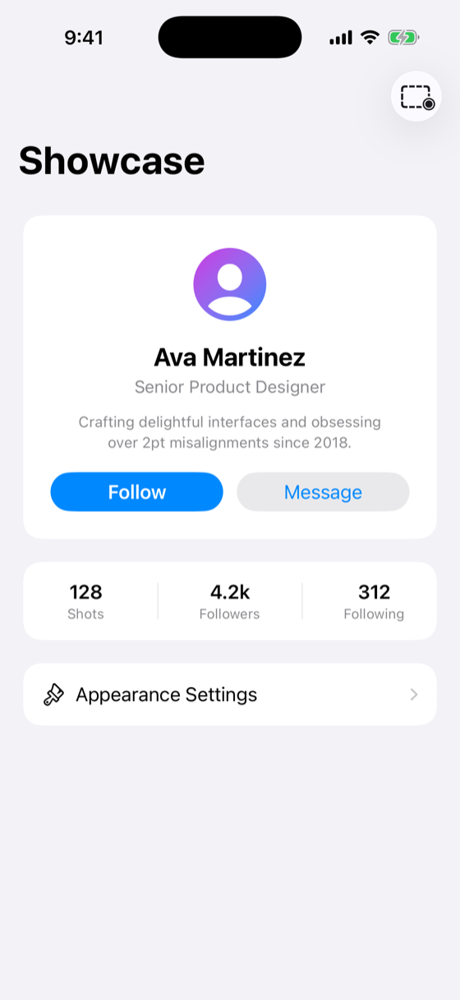
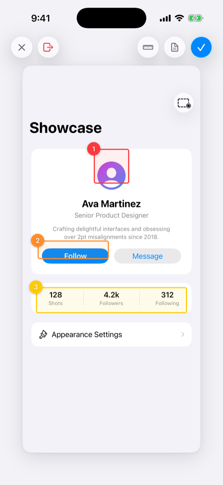
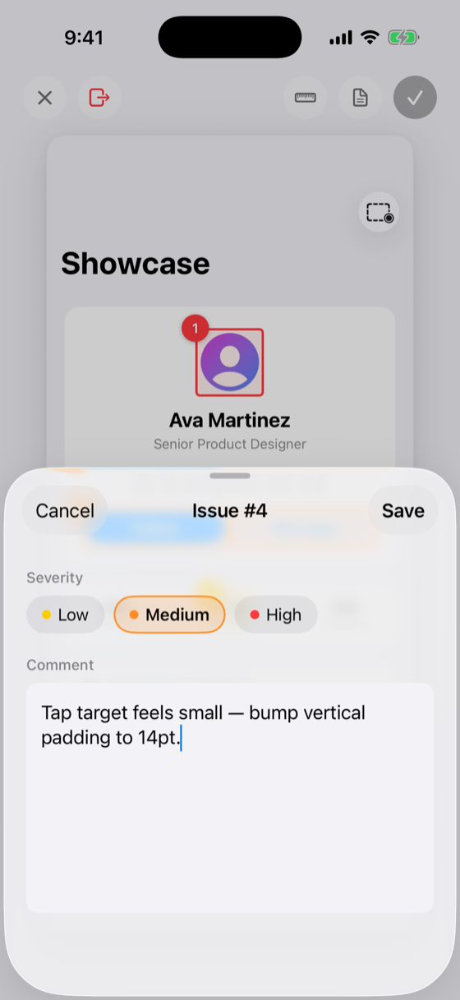
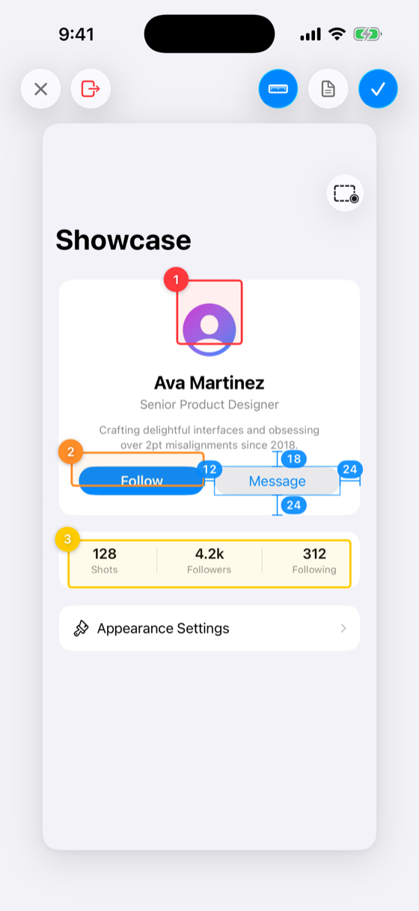
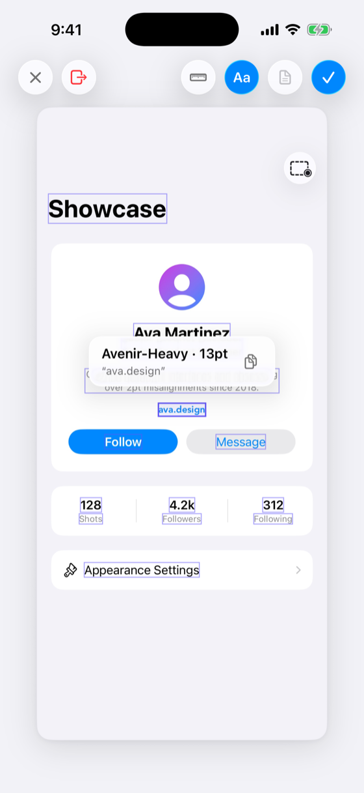
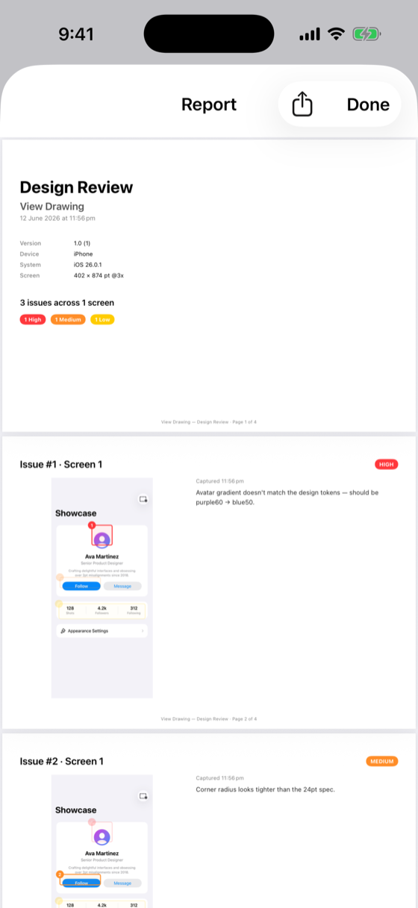

# DesignReviewKit

Capture, annotate, measure, inspect fonts, and export design feedback — from inside your iOS app.

<p align="center">
  
  
  
  
  
  
</p>

## Overview

DesignReviewKit lets designers flag UI issues where they see them. A trigger in the
host app freezes the current screen into a capture; the designer draws rectangles
over problem areas, attaches severity-rated commentary to each, and repeats across
as many screens as the review needs. The session ends in a shareable PDF report —
one page per issue, with the annotated screenshot beside the comment.

The package owns the entire flow after the trigger. The host app contributes three
lines: create an inspector, inject it, and call `beginCapture(in:)` when the
designer asks for it.

## Features

- **Frozen-screenshot annotation** — drag to draw rectangles, move and resize them
  with handles. Every annotation carries a comment by construction: the comment
  sheet appears the moment a rectangle is drawn, and cancelling it removes the
  rectangle.
- **Severity-driven visuals** — Low / Medium / High recolor the annotation live
  and drive the report's legend. Issue numbers are derived from creation order
  across the whole session, so deleting one renumbers the rest automatically.
- **Multi-screen sessions** — close the inspector, navigate the app, trigger it
  again; screens accumulate into one session with a thumbnail strip. Screens left
  without annotations evaporate, and a session whose screens are all empty ends
  itself.
- **Measurement mode** — drag to read distances in true screenshot points, with
  endpoints snapping to real element edges (recorded from the view, layer, and
  accessibility hierarchies at capture time — hairline dividers included) and a
  guide that lights up along the snapped edge. Long-press an element for a glass
  menu and read its spacing to every neighbor at once.
- **Typography mode** — tap any text element to read the font it actually
  rendered with: face name, point size, and color (swatch + hex), one row per
  styled run, custom fonts and Dynamic Type resolution included. Text elements are outlined for
  discovery, overlapping ones cycle by tap, and a copy affordance carries
  `Face · size · #hex — "text"` straight into an annotation comment. Hosts can
  map readings to their own design-token names (`headingM · brandBlue`) by
  supplying a `DesignTokenResolving` in the inspector's configuration. SwiftUI text is
  recovered by reflecting into the render graph at capture time; UIKit labels
  read directly. Readouts are tooling only — they never enter the report.
- **PDF reports** — landscape A4: a cover page with app, device, and severity
  metadata, then one page per issue with the full screenshot (siblings ghosted)
  beside the commentary. Annotations render vectorially, crisp at any zoom.
  Preview in-app, share anywhere via the system share sheet.
- **Liquid Glass UI** — the inspector presents as Apple's screenshot-editor
  pattern: the capture freezes in place, springs into a rounded card, and all
  chrome floats in glass. Built natively for iOS 26.

## Getting Started

Create one `DesignInspector` at the composition root and inject it — there is no
shared instance; the host owns the lifecycle:

```swift
@main
struct MyApp: App {
    @State private var inspector = DesignInspector()

    var body: some Scene {
        WindowGroup {
            ContentView()
                .designInspector(inspector)
        }
    }
}
```

Wire any trigger — shake, debug menu, toolbar button — to begin a capture:

```swift
@Environment(\.designInspector) private var inspector

inspector?.beginCapture(in: windowScene)
```

Gate the trigger to Debug and TestFlight builds; the package ships inert when
`Configuration(isEnabled: false)` is passed.

## Repository Layout

| Path | Contents |
|---|---|
| `DesignReviewKit/` | The Swift package — add this folder as a local package dependency |
| `View Drawing/` | Demo app showing integration: shake trigger + toolbar button |
| `DesignReviewKit-SPEC.md` | The original product specification |
| `FontInspector-SPEC.md` | Typography mode: decisions and behavior |
| `FontInspector-ARCHITECTURE.md` | Typography mode: extraction mechanism + repair playbook for future iOS releases |

The package also ships a DocC catalog — build documentation in Xcode
(<kbd>⌃⇧⌘D</kbd>) for the full guide.

## Requirements

- iOS 26.0+
- Swift 6.2 / Xcode 26
- SwiftUI host or UIKit host (the core API is window-scene based; the SwiftUI
  modifier is a thin wrapper)

## Demo

Open `View Drawing.xcodeproj`, run on any iPhone simulator, and tap the dashed
rectangle in the toolbar (or press <kbd>⌃⌘Z</kbd> to shake). Draw a rectangle on
the profile card, give it a severity and a comment, then export the PDF from the
document button in the chrome.
